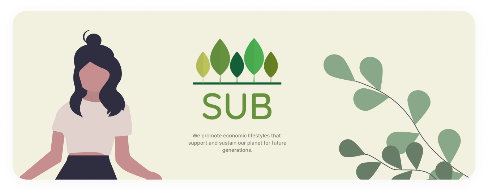

# ReThink Project! Sign up [here!](https://www.subinitiative.com/)

ReThink is a Foster RSO interested in exploring the intersection of business, sustainability, and technology. To help compensate for the lack of education in this area, we created the Sustainability Upheld in Business (SUB) Initiative to develop a centralized, web-based platform to identify and promote small, sustainable businesses. We will be providing environmentally-conscious individuals with the necessary tools to discover new, eco-friendly alternatives. Our goal is to increase sustainable consumption, thereby enabling companies to adopt green practices.

## Technologies Used

## Meet the team

## Try out a beta demo [here!](https://rethink-test.netlify.app/)
